# Plutonotes📝

Plutonotes is a web application that allows you to create notes and post your notes publicly for anyone to see. This application was created for General Assembly's Software Engineering Immersive (SEI) Program.

## Inspiration 
This is my first time taking an online course. As an online student, I wanted to build an application where students are able to not only keep their notes in one place, but also see how other students are taking their notes. The purpose of the application is to allow students to learn and share their knowledge with the world. 

## Technologies Used
- HTML 
- CSS
- JavaScript
- Node.js
- Express
- EJS templates
- MongoDB
- Mongoose
- Materialize CSS
- Oauth
- Passport
- Deployment on Heroku

## Getting Started
Access the plutonotes web app [here](https://plutonotes.herokuapp.com/home).

Cloning my repo
- Please make sure to download the following:
- `npm install`
- install method-override
- dotenv
- install mongoose 
- To run the app: `npm run dev`

## Screenshots
Landing page
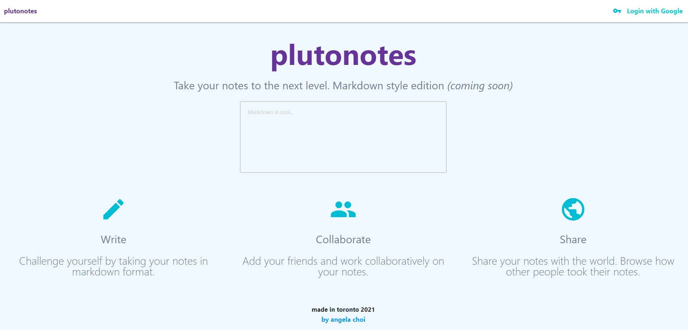
Creating a note
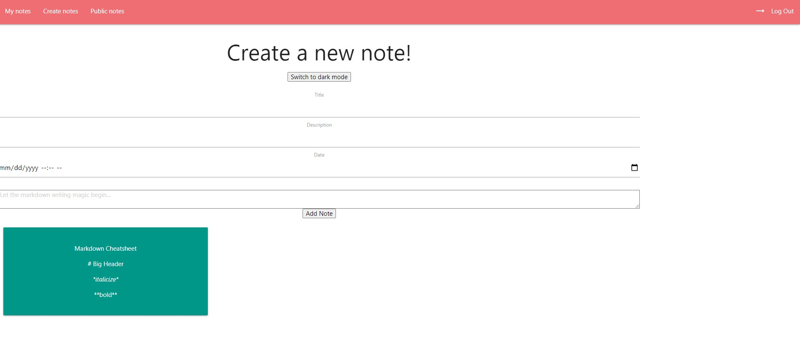
Light & Dark Mode
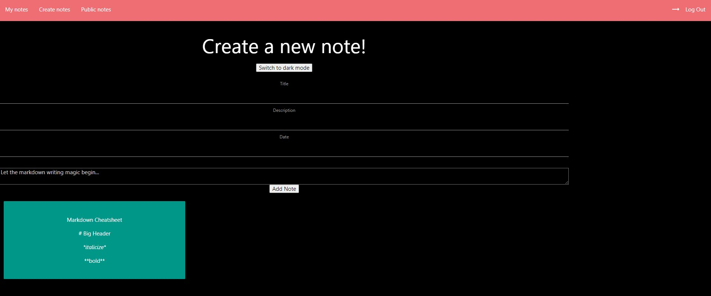
Viewing all notes
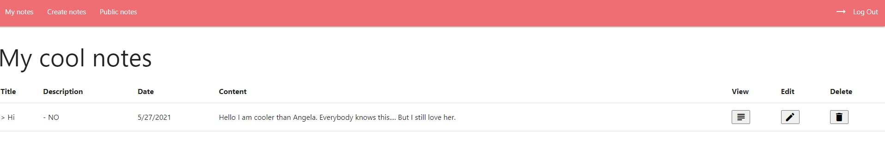
Editing a note
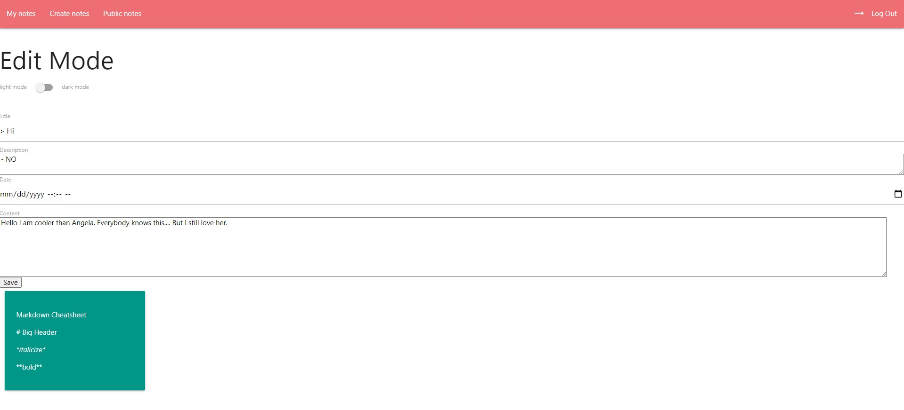
Share note publicly
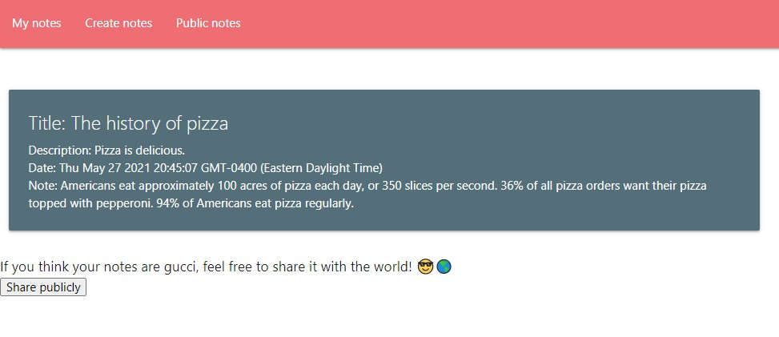
Community public notes
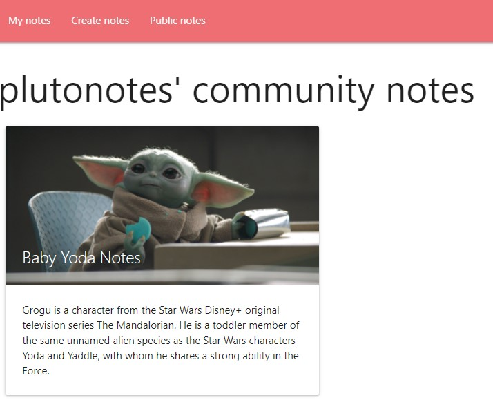

## Planning Process

### 1️⃣ User Stories
The Trello board for user stories can be found [here](https://trello.com/b/GDpTZWf2/plutonotes).

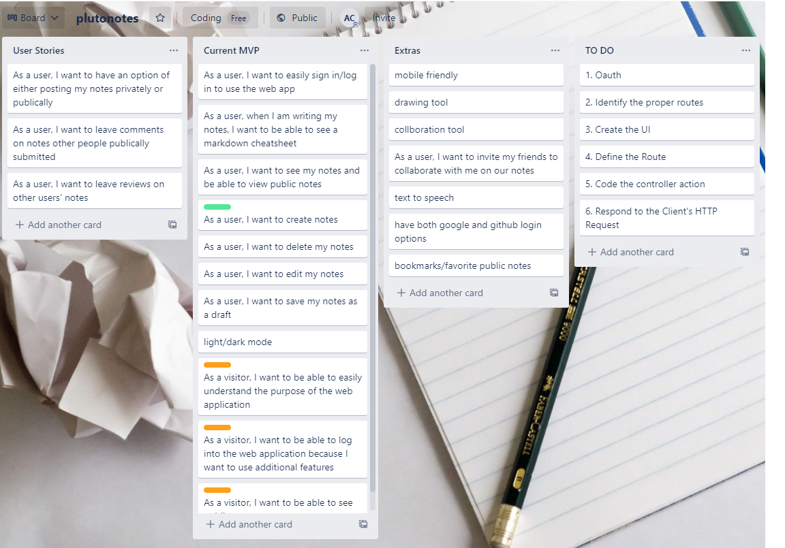
    
### 2️⃣ Wireframes
Landing page
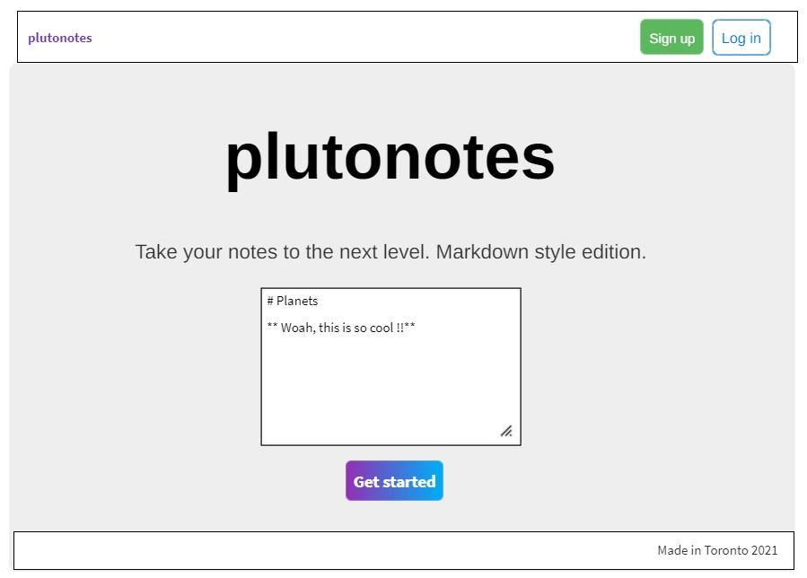 
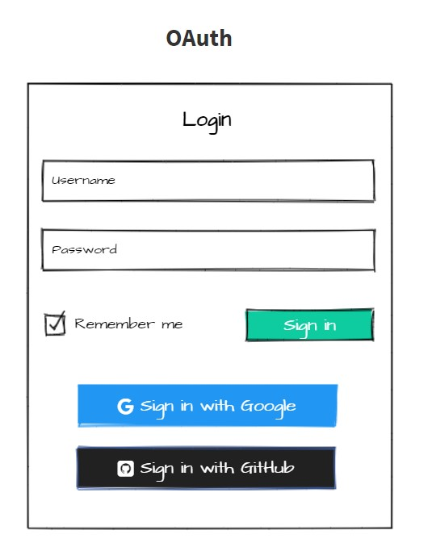
Create Note
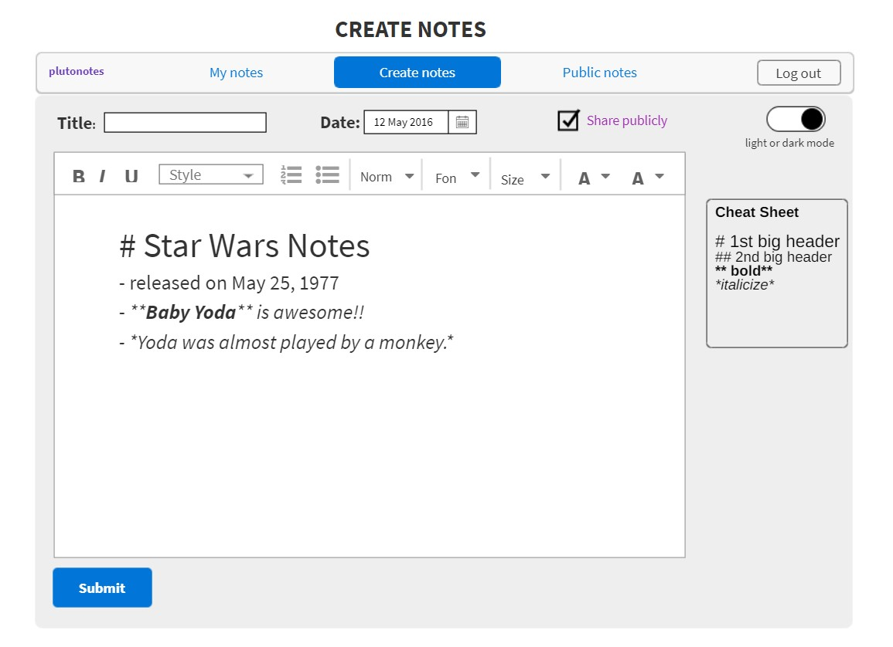
My notes
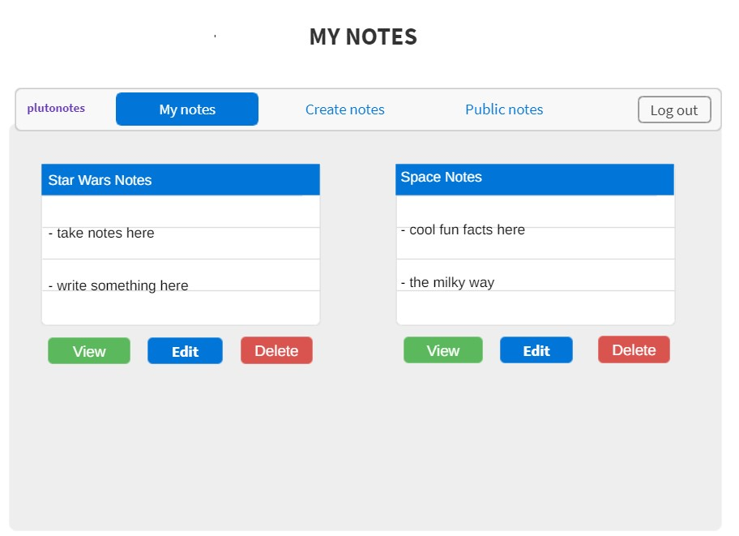
Share notes publicly
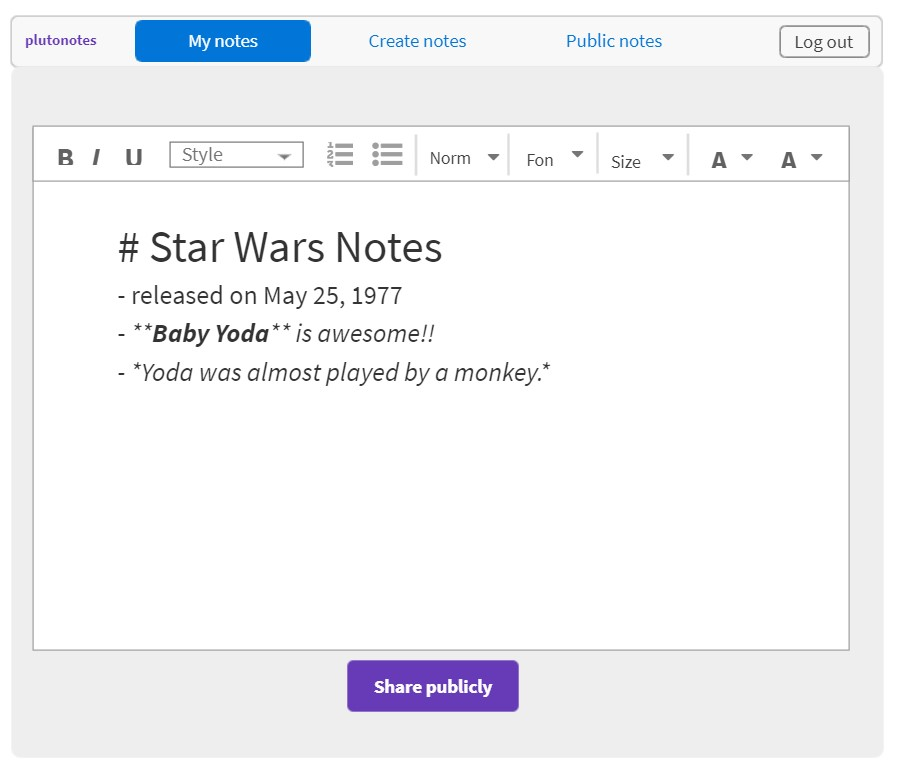
Community public notes
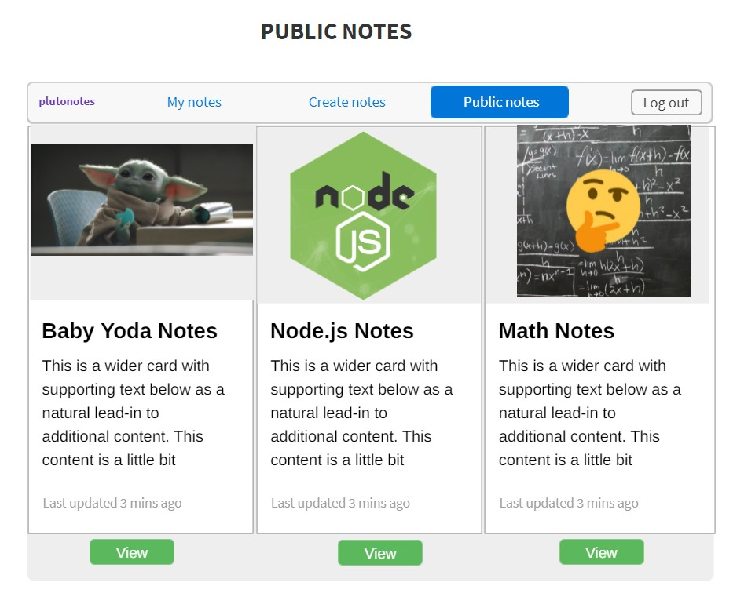
Reviews and comments on public notes
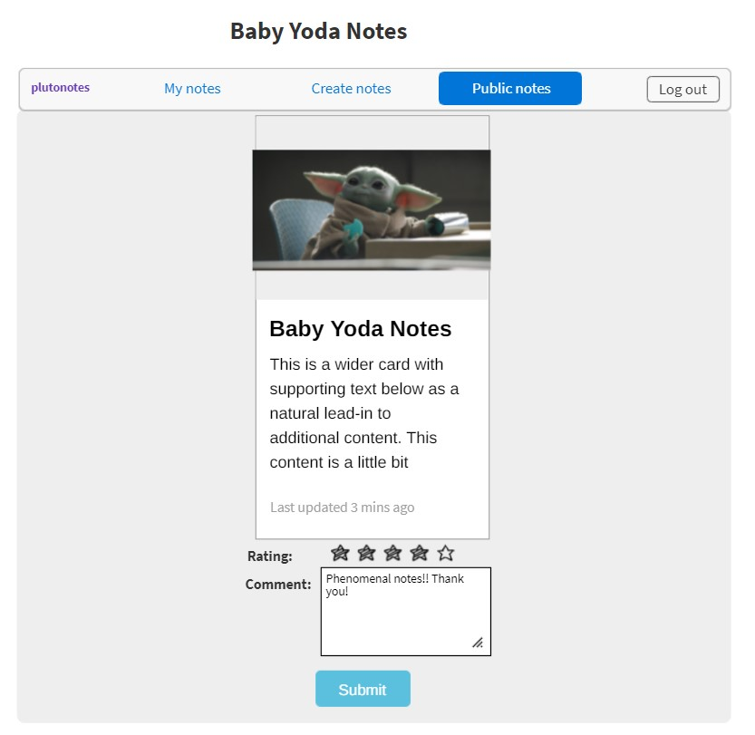

### 3️⃣ Entity Relationship Diagram
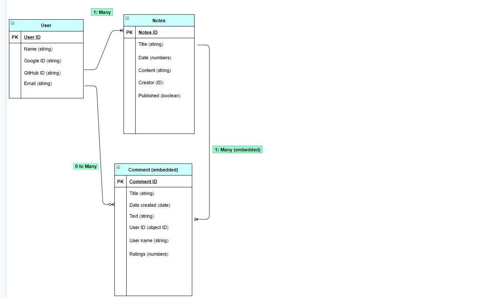

## Reflection / Difficulties Faced
❤️ Things I enjoyed:
- Working with Node.js 
    - After completing this project, Node.js is incredibly smart and powerful and can do so much! I love how all my pages connected with one another.
- Implementing OAuth
    - I feel like as an aspiring developer, it is my responsibility to create a safe environment for all users, namely, private information like passwords. I enjoyed implementing OAuth into my application. 

⛰️ Difficulties faced:
- Routing
- Posting notes to public notes section

📚 Lessons Learned:
- Keep it simple
    - I focused my attention on making sure I implemented the important functionalities such as create, edit, view, and delete before adding more features to my application. Therefore, my markdown format was on bottom of my list.
- Look at the URL for routing issues
- Substance over style
- Read the documentation!
    - Whether it is connecting to an API, incorporating CSS framework, or writing mongoose queries, reading the documentation will help you navigate how to use the language. 

## Next Steps 
The follow are the next steps in improving my application:

- Incorporating Markdown format
- Add comments and ratings on public notes section
- Collaboration feature like google docs
- Text-speech option 
- Text editor API for users when taking notes
- Include additional logins such as github